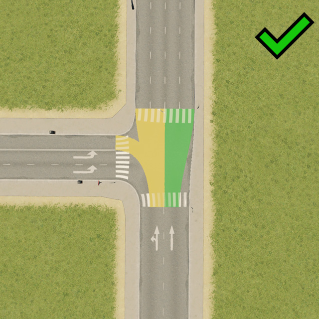
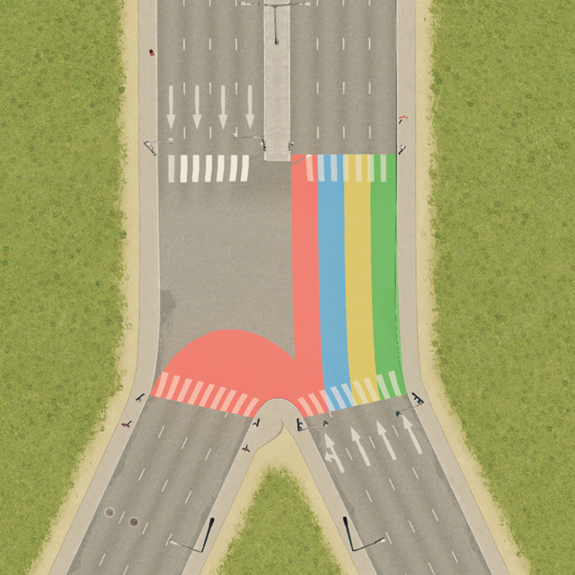

**Improved Lane Connections** (ILC) is a mod for Cities: Skylines, available for [download on the Steam Workshop](https://steamcommunity.com/sharedfiles/filedetails/?id=2119310640).

- [1 – Introduction](#1--introduction)
- [2 – The algorithm](#2--the-algorithm)
- [3 – Basic rules](#3--basic-rules)
  * [3.1 – 1-to-1 junctions](#31--1-to-1-junctions)
  * [3.2 – More lanes out than in](#32--more-lanes-out-than-in)
    + [3.2.1 – 1-to-N junctions](#321--1-to-n-junctions)
    + [3.2.2 – Other junctions](#322--other-junctions)
  * [3.3 – More lanes in than out](#33--more-lanes-in-than-out)
    + [3.3.1 – N-to-1 junctions](#331--n-to-1-junctions)
    + [3.3.2 – Other junctions](#332--other-junctions)
  * [4 – Special rules](#4--special-rules)
    + [4.1 – Sharp turns](#41--sharp-turns)
    + [4.2 – Bus lanes](#42--bus-lanes)
      - [4.2.1 – OUT bus lanes](#421--out-bus-lanes)
      - [4.2.2 – IN bus lanes](#422--in-bus-lanes)

<small><i><a href='http://ecotrust-canada.github.io/markdown-toc/'>Table of contents generated with markdown-toc</a></i></small>

# 1 – Introduction
The mod changes how traffic lanes are connected on road junctions.

**What are those "lane connections" you ask!**
Imagine a new four-way junction is built. There are two lanes on the approach to the junction, and there is a single lane leaving the junction in each direction (so, three outgoing lanes in total).

*Someone* needs to decide whether:
1. The left lane should be for turning left only, and the right lane should be for going forward and turning right **or**
2. The left lane should be for turning left and going forward, and the right lane for turning right only.

This *someone* is the game, which automatically decides which lane goes where as you build new roads. The mod attempts to make this decision making *better*.

The main aims of the mod are:
1. Fix cases which the default game rules simply do not handle well (roundabouts! – cars don't use inside lanes).
2. Improve traffic flow by favouring:
	* creation of dedicated turning lanes, especially against the flow of oncoming traffic,
	* balanced distribution of lane connections across each direction, thus spreading traffic more evenly on multi-lane roads.
3. Make bus lanes (almost) car-free by revamping handling of bus lanes at junctions.

**Are you tired of manually "fixing" every junction you build with the TM:PE lane connector every single time?** ILC will do it for you – on its own.

**Are you frustrated by mods making your game sluggish?** ILC has no performance impact on day-to-day running of your city. The only time the mod does *its things* is when (1) loading a map and (2) building or modifying a junction, and even then the impact is unnoticeable.

**Are you worried about mods breaking your saves?** ILC makes no changes to your saves whatsoever. You can subscribe or unsubscribe at any time.

**Are you concerned by mods conflicting with one another?** There are no known incompatibilities with any other mod. The changes made by ILC are very localised, and thus unlikely to cause conflicts. The mod is fully compatible with TM:PE. If you wish, you can use ILC to change the default lane connections, which you can override on individual junctions using TM:PE lane connector and lane arrow tools.

For more information about how to use the mod, refer to the [Steam Workshop page](https://steamcommunity.com/sharedfiles/filedetails/?id=2119310640).

# 2 – The algorithm
The following sections describe the lane connection algorithm used by the mod in detail.

All rules described below are for **Right-Hand Traffic (RHT)**, where cars drive on the right side of the road.

Equivalent rules apply to **Left-Hand Traffic (LHT)**, but mirrored. That is, wherever "left" or "right" is mentioned below, then in LHT these should be read as "right" and "left" respectively.

A few definitions:
* A junction is where three or more road segments meet **or** two road segments of a different kind meet.
* An incoming lane (**IN lane**) is a lane used by cars approaching a junction.
* An outgoing lane (**OUT lane**) is a lane used by cars leaving a junction.

A note on left/right/forward directions, since not all junctions are four-way crossroads intersecting at a 90° angle:
* If two road segments meet at an angle within 30° of a straight line, the corresponding lanes are considered to be in the forward direction. Otherwise the roads form a left or right turn.
* A left or right turn at an angle of 130° or more is considered to be a "sharp turn" (see *Advanced rules*).

# 3 – Basic rules
## 3.1 – 1-to-1 junctions
If the number of IN lanes is equal to the number of OUT lanes, then each IN lane connects to exactly one OUT lane.

> An example of a 1-to-1 junction. Lane connections highlighted.

## 3.2 – More lanes out than in
### 3.2.1 – 1-to-N junctions
If the number of OUT lanes is a multiple of the IN lanes, then each IN lane connects to an equal number of OUT lanes.

> Examples of 1-to-N junctions.

### 3.2.2 – Other junctions
If the number of OUT lanes is greater than the number of IN lanes, but not a multiple:
1. First, every IN lane is assigned an equal number of OUT lanes (number of OUT lanes divided by number of IN lanes, rounded down).
2. The remaining OUT lanes are distributed between the IN lanes, in such a way that:
	* any IN lane is assigned at most a single extra OUT lane,
	
	   
      
	  
	  > The second setup is rejected, as the left IN lane connects to 1 OUT lane, whereas the right IN lane connects to 4. The maximum allowed difference is one.
	  
	* if two or more IN lanes share exactly the same direction (e.g. two forward-only lanes), the IN lane on the right must not connect to more OUT lanes than its left neighbour,
	
       
      
	  
	  > The second setup is rejected, as the additional OUT lane(s) must be assigned to IN lanes from left-to-right.
	  
	* and as much as possible the following conditions are met (starting with the most desirable ones):
		* avoid IN lanes with mixed Left+Forward+Right direction, 
		
		   
		  
		  
		  > The first setup is preferred, as it avoids creation of a Left+Forward+Right IN lane.
		  
		* avoid IN lanes with mixed Left+Forward or Left+Right direction,
		
	       
          
		  
		  > The first setup is preferred, as it avoids creation of a Left+Forward IN lane.
		  
		* avoid IN lanes with mixed Forward+Right direction,
		
	       
          
		  
		  > The first setup is preferred, as it avoids creation of a Forward+Right IN lane. Also, according to a rule mentioned earlier, the extra forward OUT lane is assigned to the leftmost IN lane.

		* maximise the number of IN lanes which allow Forward direction,

		   
		  
		  
		  > The first setup is preferred, as there are more forward IN lanes.

		* equalise the number of IN-OUT connections in the same direction across all IN lanes.
		
		   
          
		  
		  > The first setup is preferred, as the forward OUT lanes are more evenly distributed between the two IN lanes.
		  
## 3.3 – More lanes in than out
### 3.3.1 – N-to-1 junctions
If the number of IN lanes is a multiple of the OUT lanes, then each OUT lane is connected to an equal number of IN lanes.

> An example of a N-to-1 junction.

### 3.3.2 – Other junctions
If the number of IN lanes is greater than the number of OUT lanes, but not a multiple:
1. First, every OUT lane is assigned an equal number of IN lanes (# of IN lanes / # of OUT lanes, rounded down).
2. Then, starting from the leftmost OUT lane, an additional IN lane is assigned to each OUT lane until all IN lanes have been assigned.

> An example of a junction with more IN lanes than OUT.

## 4 – Special rules
The rules described above are based on two assumptions:
* There are no bus lanes involved.
* There are no sharp turns (≥130°).

### 4.1 – Sharp turns
If any sharp turns are present at a junction, the basic rules are applied as if the sharp turning OUT lanes did not exist.

Then, sharp left OUT lanes are assigned to the leftmost IN lane, and sharp right OUT lanes are assigned to the rightmost IN lane.

Exception: if ignoring the sharp turning OUT lanes would mean there are more IN lanes than OUT lanes, then some or all of the sharp turning OUT lanes are instead treated as normal OUT lanes.

 

> The first junction features sharp turning lanes (≥130°), the second junction does not.

### 4.2 – Bus lanes
#### 4.2.1 – OUT bus lanes
If any OUT lanes are bus lanes, the basic rules are applied as if these lanes did not exist.

Then, each OUT bus lane is assigned to the same IN lane as the OUT lane to its right, unless:
* the OUT bus lane is the rightmost OUT lane, or
* the OUT bus lane is a left-turn and the corresponding IN lane does not already allow turning left.

In either case, the OUT bus lane is assigned to the same IN lane, as the OUT lane to its left.

Exception: If there are fewer non-bus OUT lanes than IN lanes, then basic rules are applied as normal. This also applies if all OUT lanes are bus lanes.

> An example of a junction with outgoing, but no incoming bus lanes.

#### 4.2.2 – IN bus lanes
If any IN lanes are bus lanes, the basic rules are applied as if these lanes did not exist.

Then, the IN bus lanes are assigned the same OUT lanes as their neighbouring non-bus IN lanes.

Exception: If all IN lanes are bus lanes, then basic rules are applied as normal.

> An example of a junction with incoming, but no outgoing bus lanes.

> An example of a junction with both incoming and outgoing bus lanes.